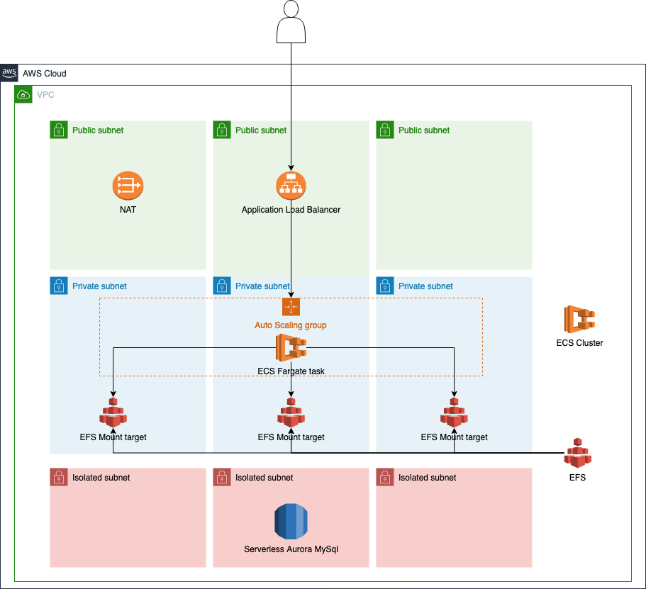

# Wordpress su ECS

Questo repository contiene codice IaaC scritto con CDK Typescript per creare un sito wordpress che è scalabaile, sicuro e veloce.

It build the network part which is composed from 9 subnet in order to use all the AZ of the region: 3 public, 3 private and 3 isolated.
The first one are required to host all the componenet which need to be public like the load balancer and the NAT gateway. 
The second one host the components that need to access internet but cannot be reachable from internet like the ecs container.
The final one are complete isolated subnet which host all the resources that don't need to access and be accessed from internet like the database.

## Configurazione e deploy
Per poter deployare questa soluzione è necessario creare un repository codecommit sul proprio account e configurare i seguenti parametri contenuti nel file di ambiente `environments/environment.dev.ts` con le configurazioni del proprio account:
```
accountId: 'ACCOUNT_ID', // inserire il proprio AWS Account ID
	region: 'eu-central-1', // inserire la region in cui si vuole deployare la soluzione
	repository: {
		arn: "arn:aws:codecommit:eu-central-1:ACCOUNT_ID:wordpress-ecs", // inserire l'arn del proprio repository codecommit
		branch: "develop",
	},
```

Successivamente è necessario installare le dipendenze con `npm install` e infine è possibile lanciare il deploy con il seguente script `npm run deploy:dev`.
Questo crea una pipeline CDK che partendo dal repository su codecommit deploya tutta l'infrastruttura sull'account. In questo modo per i successivi rilasci non è più necessario lanciare lo script di deploy ma sarà sufficiente fare un push e sarà la pipeline a preoccuparsi di rilasciare le nuove modifiche sull'account.

N.B.: se non si vuole configurare un repository codecommit, è possibile fare il deploy a mano dell'infrastruttura evitando quindi di creare la pipeline. Per far ciò, è sufficiente impostare nel file di environment il parametro `infrastructurePipeline` a `false`. In questo modo però ogni qual volta si fa una modifica sarà necessario lanciare il deploy perdendo la comodità della gestione dell'infrastruttura tramite la pipeline.

L'infrastruttura che verrà creata è composta da una parte di network, una di compute, una di storage e una pipeline applicativa.
Questo è lo schema infrastrutturale della soluzione 
## Network
Il network è stato creato utilizzando una vpc /16 composto da 9 subnet /24: 3 pubbliche per ospitare le risorse che devono essere accedute da internet, 3 private che ospitano le risorse che devono accedere ad internet ma non devono essere accedute e infine 3 isolate che ospitano risorse completamente private. Questa configurazione è stata scelta per poter sfruttare tutte le az della region.
## Compute
La parte di compute consiste in un cluster ecs con al suo interno un unico servizio contenente un container con wordpress. Il servizio è stato creato con la modalità Fargate in autoscaling. In questo modo vengono creati dei container in base al carico sulla cpu sulle subnet private.
## Database
Il database creato è un aurora serverless v1 nel caso dell'ambiente di dev in modo da abbattere i costi siccome si spegne se inutilizzato. Mentre per l'ambiente di produzione è stato creato un database serverfull cluster sempre con Aurora per ovviare ai problemi dei ritardi nella scalabilità di aurora serverless v1.
## Pipeline
La pipeline applicativa è composta da 3 step:
- Source su ECR;
- Creazione della definizione dell'immagine di ECS;
- Deploy della nuova immagine su ECS;

Essa viene lanciata quando viene pushata una nuova immagine su ECR e si occupa di rilasciare la nuova versione su ECS. Il flow quindi sarebbe:
- modifico la mia immagine docker di wordpress;
- faccio un push su codecommit; 
- parte la pipeline dell'infrastruttura che crea la nuova immagine su ECR;
- parte la pipeline applicativa che deploya la nuova immagine su ECS;
